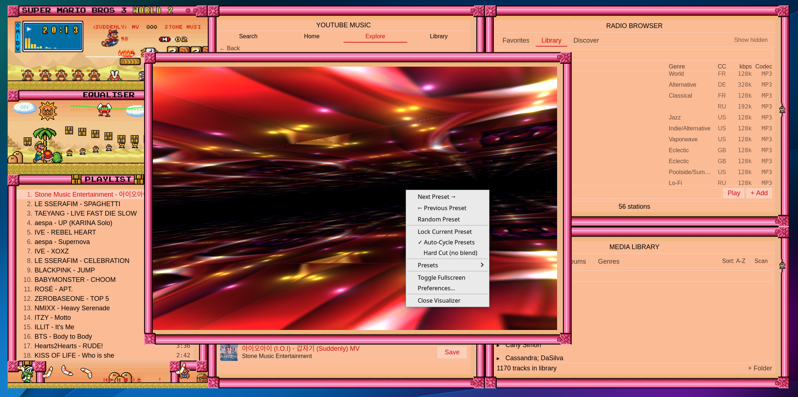

# RetroAmp

A cross-platform desktop audio player inspired by Winamp 2.x.
Plays your local files, internet radio, and YouTube Music — and yes,
it really renders the classic `.wsz` skins.


---

## A note from the author

RetroAmp is a labour of love. Like so many people I have a lot of nostalgia
for the good old days of Winamp, internet radio, downloading random songs,
and just that feeling of discovery. The simple joy of just listening to
music, and picking your favourite Winamp skin, maybe watching the trippy
visualizer, it really made your computer feel like your own. And spending
time on the computer just listening to music was a whole activity in
itself.

I wanted to bring that feeling back, so I created RetroAmp. It's a clean
sheet project built in Rust / Tauri, on top of open source libraries — all
of which are credited in [`THIRD_PARTY_LICENSES.md`](THIRD_PARTY_LICENSES.md).
But as you can tell from the screenshots, it's capable of rendering the
classic Winamp WSZ skins! And so as a result it has that same familiar
layout, so that all the buttons are where the skins expect them to be.

But there are lots of other exciting features too, such as internet radio
(which just works without any setup required), YouTube Music — including
the ability to sign in to your account to get all of your saved playlists,
and like/add tracks. It has a full local media browser which supports
adding/editing tags to songs. It has a functional graphic equalizer, and
of course the classic visualizer. The whole thing is backed by a tiny
local database to remember your preferences.

All rights and credit to the copyright holders of the open source
libraries used in the creation of RetroAmp; full attribution lives in
[`THIRD_PARTY_LICENSES.md`](THIRD_PARTY_LICENSES.md). RetroAmp can load
any `.wsz` skin — a selection is bundled to get you started, but you can
always add more (see [Adding skins](#adding-skins) below). If there's any
issue at all with the licenses for the bundled skins themselves please
contact me and I'll make sure those are removed.

Happy listening!

---

## Features

- **Local playback** — MP3, FLAC, AAC, ALAC, OGG Vorbis, WAV and more, via Symphonia
- **Internet radio** — built-in station browser and search; no setup required
- **Radio recording** — capture what you're listening to straight to disk
- **YouTube Music** — sign in to access your library, playlists, likes, and search
- **Classic Winamp skins** — ships with 300+ `.wsz` skins; drop in your own anytime
- **10-band graphic equalizer** — real DSP in the audio pipeline, not just a UI
- **Milkdrop-style visualizer** — powered by Butterchurn presets
- **Local media library** — browse by artist/album, with a built-in tag editor
- **Multi-window layout** — detachable, resizable, just like the original
- **System integration** — media keys, system tray, "Now Playing" in your OS
- **Tiny footprint** — a small SQLite database remembers your preferences

## Screenshots

**The classic look — main window, equalizer, and playlist**

| | |
| --- | --- |
|  |  |

**Multi-window, detachable, resizable — just like the original**

| | |
| --- | --- |
|  |  |

**Skins — bundled library plus anything you drop in**

| | |
| --- | --- |
|  |  |

**Internet radio — browse, search, and record**

| | |
| --- | --- |
|  |  |
|  | |

**YouTube Music — sign in for your playlists, likes, and library**

| | |
| --- | --- |
|  |  |

**Local library and tag editor**


**Milkdrop-style visualizer**



## Installation

Grab the latest build for your operating system from the
[Releases page](https://github.com/DevSpecAliPrice/RetroAmp/releases/latest):

- **Windows** — download `RetroAmp_*_x64-setup.exe` and run it.
- **macOS** — download `RetroAmp_*_universal.dmg`, open it, and drag RetroAmp
  to your Applications folder.
- **Linux** — pick whichever suits your distro:
  - `.AppImage` — portable, just make it executable and run
  - `.deb` — Debian, Ubuntu, Mint, etc.
  - `.rpm` — Fedora, openSUSE, etc.

### First-launch warnings

RetroAmp's installers aren't currently signed with paid OS-vendor certificates,
so you'll see a one-time warning on Windows and macOS. This is normal for
small open-source apps.

- **Windows**: SmartScreen will say "Windows protected your PC." Click
  **More info** → **Run anyway**.
- **macOS**: Gatekeeper will say "RetroAmp can't be opened because Apple
  cannot check it for malicious software." Right-click the app → **Open**,
  then **Open** again on the confirmation dialog. You only need to do this
  once.
- **Linux**: no warnings. AppImage just needs `chmod +x` first.

After install, RetroAmp checks for updates on startup and prompts you when
a new version is available.

## Adding skins

RetroAmp ships with a built-in **Skin Library** — open it from the menu to
browse, switch, and favourite the bundled skins.

To add your own:

1. Find any classic Winamp `.wsz` skin (sites like the
   [Winamp Skin Museum](https://skins.webamp.org/) have thousands).
2. In RetroAmp, open the Skin Library and use the **Add Skin** button to
   import the `.wsz` file.

That's it — skins are stored locally and instantly switchable.

## Building from source

Most people don't need this — just grab a release. But if you want to
build RetroAmp yourself:

**Prerequisites**: [Rust](https://rustup.rs/),
[Node.js](https://nodejs.org/) 20+, and [pnpm](https://pnpm.io/) 10+.

```sh
git clone https://github.com/DevSpecAliPrice/RetroAmp.git
cd RetroAmp
pnpm install
pnpm tauri dev      # run from source
pnpm tauri build    # produce installers in src-tauri/target/release/bundle/
```

Linux builds additionally need the usual Tauri system dependencies
(`webkit2gtk`, `libayatana-appindicator`, etc.) — see the
[Tauri prerequisites guide](https://tauri.app/start/prerequisites/) for
your distro.

## License

RetroAmp itself is released under the [MIT License](LICENSE).

It bundles or links against a number of third-party open-source components.
Full attribution and license notices — including the required Fraunhofer FDK
AAC Codec notice — are in [`THIRD_PARTY_LICENSES.md`](THIRD_PARTY_LICENSES.md).

## Credits

Special thanks to:

- **Jordan Eldredge** and the [Webamp](https://github.com/captbaritone/webamp)
  project — RetroAmp's skin sprite tables and bitmap-font layout are ported
  from Webamp's source.
- The [Butterchurn](https://butterchurnviz.com) project for the in-app
  Milkdrop visualizer.
- The maintainers of Symphonia, cpal, Tauri, and every other dependency
  listed in [`THIRD_PARTY_LICENSES.md`](THIRD_PARTY_LICENSES.md).
- The countless skin authors of the Winamp community, whose work makes
  this app feel alive.
